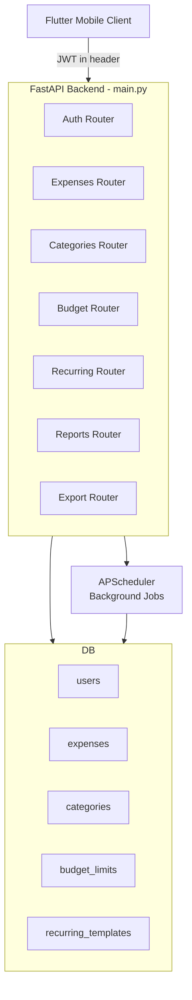
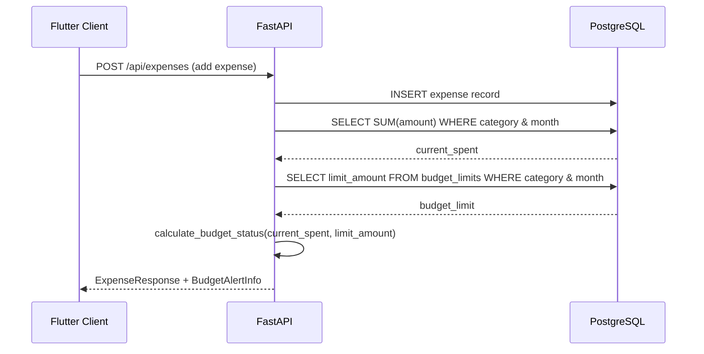
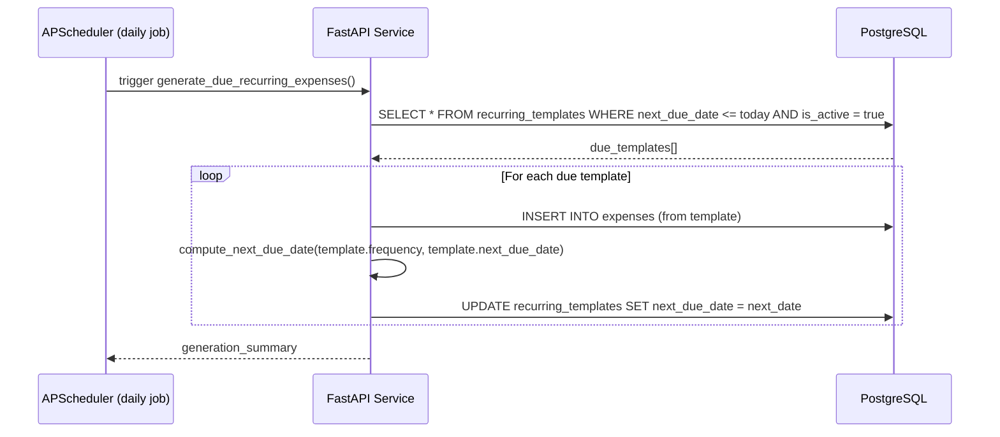
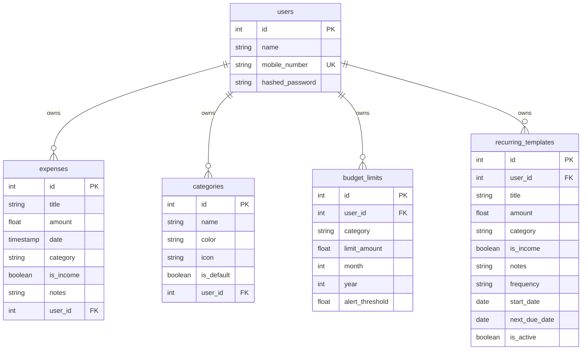

# Design Document: Expense Tracker Enhancements

## Overview

This document covers the technical design for five major enhancements to the existing FastAPI Expense Tracker backend: budget limits & alerts, recurring expenses, custom expense categories management, reports & analytics, and CSV/PDF export. The existing system is a single-file FastAPI application using SQLAlchemy ORM with PostgreSQL, JWT authentication, and a Flutter mobile client.

The enhancements extend the current two-table schema (users, expenses) with four new tables and introduce twelve new API endpoints, while preserving full backward compatibility with existing endpoints and the Flutter client.

---

## Architecture

### System Component Overview



### Request Flow for Budget Alert Check



### Recurring Expense Generation Flow




---

## Database Schema

### Extended Entity-Relationship Diagram



### New Table Definitions (SQLAlchemy Models)

```python
class CategoryDB(Base):
    __tablename__ = "categories"

    id = Column(Integer, primary_key=True, index=True)
    name = Column(String, nullable=False)
    color = Column(String, default="#607D8B")   # hex color for UI
    icon = Column(String, default="category")   # icon name for Flutter
    is_default = Column(Boolean, default=False) # system-seeded defaults
    user_id = Column(Integer, ForeignKey("users.id", ondelete="CASCADE"), nullable=False)

    owner = relationship("UserDB", back_populates="categories")


class BudgetLimitDB(Base):
    __tablename__ = "budget_limits"

    id = Column(Integer, primary_key=True, index=True)
    user_id = Column(Integer, ForeignKey("users.id", ondelete="CASCADE"), nullable=False)
    category = Column(String, nullable=False)
    limit_amount = Column(Float, nullable=False)
    month = Column(Integer, nullable=False)   # 1-12
    year = Column(Integer, nullable=False)
    alert_threshold = Column(Float, default=0.8)  # 0.0-1.0, alert at 80% by default

    owner = relationship("UserDB", back_populates="budget_limits")


class RecurringTemplateDB(Base):
    __tablename__ = "recurring_templates"

    id = Column(Integer, primary_key=True, index=True)
    user_id = Column(Integer, ForeignKey("users.id", ondelete="CASCADE"), nullable=False)
    title = Column(String, nullable=False)
    amount = Column(Float, nullable=False)
    category = Column(String, nullable=False)
    is_income = Column(Boolean, default=False)
    notes = Column(String, default="")
    frequency = Column(String, nullable=False)  # "daily" | "weekly" | "monthly"
    start_date = Column(Date, nullable=False)
    next_due_date = Column(Date, nullable=False)
    is_active = Column(Boolean, default=True)

    owner = relationship("UserDB", back_populates="recurring_templates")
```


---

## Data Models

This section consolidates all Pydantic request/response schemas used across the API as a formal reference.

### Category Models

**`CategoryCreate`** — Request body for creating a new category.
```python
class CategoryCreate(BaseModel):
    name: str = Field(..., min_length=1, max_length=50)
    color: Optional[str] = "#607D8B"
    icon: Optional[str] = "category"
```

**`CategoryResponse`** — Response schema returned for category records.
```python
class CategoryResponse(BaseModel):
    id: int
    name: str
    color: str
    icon: str
    is_default: bool
    user_id: int

    model_config = ConfigDict(from_attributes=True)
```

---

### Budget Models

**`BudgetLimitCreate`** — Request body for setting a monthly budget cap per category.
```python
class BudgetLimitCreate(BaseModel):
    category: str
    limit_amount: float = Field(..., gt=0)
    month: int = Field(..., ge=1, le=12)
    year: int = Field(..., ge=2000)
    alert_threshold: float = Field(default=0.8, ge=0.0, le=1.0)
```

**`BudgetLimitResponse`** — Response schema for a stored budget limit record.
```python
class BudgetLimitResponse(BaseModel):
    id: int
    category: str
    limit_amount: float
    month: int
    year: int
    alert_threshold: float
    user_id: int

    model_config = ConfigDict(from_attributes=True)
```

**`BudgetStatusResponse`** — Computed response showing real-time spending vs. limit for a category.
```python
class BudgetStatusResponse(BaseModel):
    category: str
    limit_amount: float
    spent_amount: float
    remaining_amount: float
    usage_percentage: float
    alert_level: str   # "ok" | "warning" | "exceeded"
    month: int
    year: int
```

---

### Recurring Models

**`RecurringTemplateCreate`** — Request body for defining a recurring expense template.
```python
class RecurringTemplateCreate(BaseModel):
    title: str
    amount: float = Field(..., gt=0)
    category: str
    is_income: bool = False
    notes: Optional[str] = ""
    frequency: str = Field(..., pattern="^(daily|weekly|monthly)$")
    start_date: datetime.date
```

**`RecurringTemplateResponse`** — Response schema for a recurring template record.
```python
class RecurringTemplateResponse(BaseModel):
    id: int
    title: str
    amount: float
    category: str
    is_income: bool
    notes: str
    frequency: str
    start_date: datetime.date
    next_due_date: datetime.date
    is_active: bool
    user_id: int

    model_config = ConfigDict(from_attributes=True)
```

---

### Report Models

**`MonthlySummaryResponse`** — Aggregated income/expense totals for a given month.
```python
class MonthlySummaryResponse(BaseModel):
    month: int
    year: int
    total_income: float
    total_expenses: float
    net_balance: float
    transaction_count: int
    top_expense_category: Optional[str]
```

**`CategoryBreakdownResponse`** — Per-category spending breakdown for a given month.
```python
class CategoryBreakdownResponse(BaseModel):
    category: str
    total_amount: float
    transaction_count: int
    percentage_of_total: float
```

**`MonthlyTrendResponse`** — Income vs. expense totals per month, used for trend charts.
```python
class MonthlyTrendResponse(BaseModel):
    month: int
    year: int
    total_income: float
    total_expenses: float
    net_balance: float
```

**`ChartDataResponse`** — Generic chart payload consumed by the Flutter client.
```python
class ChartDataResponse(BaseModel):
    chart_type: str          # "pie" | "bar" | "line"
    labels: List[str]
    datasets: List[dict]     # [{label, data, colors}]
```

---

### Export Models

**`ExportParams`** — Query parameters for CSV and PDF export endpoints.
```python
class ExportParams(BaseModel):
    start_date: datetime.date
    end_date: datetime.date
    category: Optional[str] = None      # filter by category
    is_income: Optional[bool] = None    # filter income/expense only
```

---

## Components and Interfaces

### 1. Categories Management

**Purpose**: Replace hardcoded category strings with user-owned, persisted category records. Seed default categories on first use.

**API Surface**:
```
GET    /api/categories              → List[CategoryResponse]
POST   /api/categories              → CategoryResponse (201)
PUT    /api/categories/{id}         → CategoryResponse
DELETE /api/categories/{id}         → {"detail": "..."}
```

**Pydantic Schemas**:
```python
class CategoryCreate(BaseModel):
    name: str = Field(..., min_length=1, max_length=50)
    color: Optional[str] = "#607D8B"
    icon: Optional[str] = "category"

class CategoryResponse(BaseModel):
    id: int
    name: str
    color: str
    icon: str
    is_default: bool
    user_id: int

    model_config = ConfigDict(from_attributes=True)
```

**Default Categories** (seeded on first GET if user has none):
```python
DEFAULT_CATEGORIES = [
    {"name": "Food & Dining",   "color": "#FF5722", "icon": "restaurant"},
    {"name": "Transport",       "color": "#2196F3", "icon": "directions_car"},
    {"name": "Shopping",        "color": "#9C27B0", "icon": "shopping_bag"},
    {"name": "Entertainment",   "color": "#FF9800", "icon": "movie"},
    {"name": "Health",          "color": "#4CAF50", "icon": "local_hospital"},
    {"name": "Utilities",       "color": "#607D8B", "icon": "bolt"},
    {"name": "Salary",          "color": "#00BCD4", "icon": "work"},
    {"name": "Other",           "color": "#9E9E9E", "icon": "more_horiz"},
]
```

---

### 2. Budget Limits & Alerts

**Purpose**: Allow users to set a monthly spending cap per category. When an expense is added, the system calculates current spend and returns alert status inline.

**API Surface**:
```
GET    /api/budgets                         → List[BudgetLimitResponse]
POST   /api/budgets                         → BudgetLimitResponse (201)
PUT    /api/budgets/{id}                    → BudgetLimitResponse
DELETE /api/budgets/{id}                    → {"detail": "..."}
GET    /api/budgets/status?month=&year=     → List[BudgetStatusResponse]
```

**Pydantic Schemas**:
```python
class BudgetLimitCreate(BaseModel):
    category: str
    limit_amount: float = Field(..., gt=0)
    month: int = Field(..., ge=1, le=12)
    year: int = Field(..., ge=2000)
    alert_threshold: float = Field(default=0.8, ge=0.0, le=1.0)

class BudgetLimitResponse(BaseModel):
    id: int
    category: str
    limit_amount: float
    month: int
    year: int
    alert_threshold: float
    user_id: int

    model_config = ConfigDict(from_attributes=True)

class BudgetStatusResponse(BaseModel):
    category: str
    limit_amount: float
    spent_amount: float
    remaining_amount: float
    usage_percentage: float
    alert_level: str   # "ok" | "warning" | "exceeded"
    month: int
    year: int
```


---

### 3. Recurring Expenses

**Purpose**: Users define templates that auto-generate expense entries on a schedule. A background APScheduler job runs daily to create due entries.

**API Surface**:
```
GET    /api/recurring                → List[RecurringTemplateResponse]
POST   /api/recurring                → RecurringTemplateResponse (201)
PUT    /api/recurring/{id}           → RecurringTemplateResponse
DELETE /api/recurring/{id}           → {"detail": "..."}
POST   /api/recurring/{id}/pause     → RecurringTemplateResponse
POST   /api/recurring/{id}/resume    → RecurringTemplateResponse
```

**Pydantic Schemas**:
```python
class RecurringTemplateCreate(BaseModel):
    title: str
    amount: float = Field(..., gt=0)
    category: str
    is_income: bool = False
    notes: Optional[str] = ""
    frequency: str = Field(..., pattern="^(daily|weekly|monthly)$")
    start_date: datetime.date

class RecurringTemplateResponse(BaseModel):
    id: int
    title: str
    amount: float
    category: str
    is_income: bool
    notes: str
    frequency: str
    start_date: datetime.date
    next_due_date: datetime.date
    is_active: bool
    user_id: int

    model_config = ConfigDict(from_attributes=True)
```

---

### 4. Reports & Analytics

**Purpose**: Provide aggregated financial data for the Flutter client to render charts and summaries.

**API Surface**:
```
GET /api/reports/monthly-summary?month=&year=      → MonthlySummaryResponse
GET /api/reports/category-breakdown?month=&year=   → List[CategoryBreakdownResponse]
GET /api/reports/income-vs-expense?year=           → List[MonthlyTrendResponse]
GET /api/reports/chart-data?month=&year=&type=     → ChartDataResponse
```

**Pydantic Schemas**:
```python
class MonthlySummaryResponse(BaseModel):
    month: int
    year: int
    total_income: float
    total_expenses: float
    net_balance: float
    transaction_count: int
    top_expense_category: Optional[str]

class CategoryBreakdownResponse(BaseModel):
    category: str
    total_amount: float
    transaction_count: int
    percentage_of_total: float

class MonthlyTrendResponse(BaseModel):
    month: int
    year: int
    total_income: float
    total_expenses: float
    net_balance: float

class ChartDataResponse(BaseModel):
    chart_type: str          # "pie" | "bar" | "line"
    labels: List[str]
    datasets: List[dict]     # [{label, data, colors}]
```

---

### 5. Export (CSV / PDF)

**Purpose**: Allow users to download their expense data filtered by date range in CSV or PDF format.

**API Surface**:
```
GET /api/export/csv?start_date=&end_date=    → StreamingResponse (text/csv)
GET /api/export/pdf?start_date=&end_date=    → StreamingResponse (application/pdf)
```

**Query Parameters**:
```python
class ExportParams(BaseModel):
    start_date: datetime.date
    end_date: datetime.date
    category: Optional[str] = None      # filter by category
    is_income: Optional[bool] = None    # filter income/expense only
```


---

## Key Functions with Formal Specifications

### Function: `calculate_budget_status`

```python
def calculate_budget_status(
    db: Session,
    user_id: int,
    category: str,
    month: int,
    year: int
) -> Optional[BudgetStatusResponse]:
```

**Preconditions**:
- `user_id` refers to an existing user in the database
- `month` is in range [1, 12]
- `year` >= 2000
- `category` is a non-empty string

**Postconditions**:
- Returns `None` if no budget limit is set for the given category/month/year
- Returns `BudgetStatusResponse` with `alert_level = "ok"` if `usage_percentage < alert_threshold`
- Returns `BudgetStatusResponse` with `alert_level = "warning"` if `alert_threshold <= usage_percentage < 1.0`
- Returns `BudgetStatusResponse` with `alert_level = "exceeded"` if `usage_percentage >= 1.0`
- `spent_amount` equals the sum of all non-income expenses for the user in the given category, month, and year
- `remaining_amount = limit_amount - spent_amount` (may be negative if exceeded)
- `usage_percentage = spent_amount / limit_amount`

**Loop Invariants**: N/A (no loops; uses SQL aggregation)

---

### Function: `compute_next_due_date`

```python
def compute_next_due_date(
    frequency: str,
    current_due_date: datetime.date
) -> datetime.date:
```

**Preconditions**:
- `frequency` is one of `"daily"`, `"weekly"`, `"monthly"`
- `current_due_date` is a valid date

**Postconditions**:
- If `frequency == "daily"`: returns `current_due_date + timedelta(days=1)`
- If `frequency == "weekly"`: returns `current_due_date + timedelta(weeks=1)`
- If `frequency == "monthly"`: returns date with month incremented by 1, clamped to last day of next month if needed (e.g., Jan 31 → Feb 28)
- Returned date is always strictly greater than `current_due_date`

**Loop Invariants**: N/A

---

### Function: `generate_due_recurring_expenses`

```python
def generate_due_recurring_expenses(db: Session) -> dict:
```

**Preconditions**:
- `db` is an active SQLAlchemy session
- `recurring_templates` table exists and is accessible

**Postconditions**:
- For every active template where `next_due_date <= today`: one new `ExpenseDB` record is inserted
- Each processed template's `next_due_date` is updated to `compute_next_due_date(template.frequency, template.next_due_date)`
- Templates with `is_active = False` are not processed
- Returns `{"generated": int, "errors": int}` summary dict
- All insertions and updates are committed atomically per template (individual try/except to avoid one failure blocking others)

**Loop Invariants**:
- All templates processed before the current iteration have either had an expense generated and `next_due_date` advanced, or been recorded as an error
- The count of `generated + errors` equals the number of templates iterated so far


---

### Function: `compute_monthly_summary`

```python
def compute_monthly_summary(
    db: Session,
    user_id: int,
    month: int,
    year: int
) -> MonthlySummaryResponse:
```

**Preconditions**:
- `user_id` refers to an existing user
- `month` in [1, 12], `year` >= 2000

**Postconditions**:
- `total_income` = SUM of `amount` WHERE `is_income = True` for user in given month/year (0.0 if none)
- `total_expenses` = SUM of `amount` WHERE `is_income = False` for user in given month/year (0.0 if none)
- `net_balance = total_income - total_expenses`
- `transaction_count` = total number of expense records for user in given month/year
- `top_expense_category` = category with highest total spend (expenses only), `None` if no expenses

---

### Function: `generate_csv_export`

```python
def generate_csv_export(
    db: Session,
    user_id: int,
    start_date: datetime.date,
    end_date: datetime.date,
    category: Optional[str],
    is_income: Optional[bool]
) -> io.StringIO:
```

**Preconditions**:
- `start_date <= end_date`
- `user_id` refers to an existing user

**Postconditions**:
- Returns a `StringIO` buffer containing valid CSV data
- CSV header row: `id,title,amount,date,category,is_income,notes`
- Each row corresponds to one expense record matching all filters
- Records are ordered by `date` ascending
- If no records match, returns CSV with header row only (no data rows)

---

### Function: `generate_pdf_export`

```python
def generate_pdf_export(
    db: Session,
    user_id: int,
    start_date: datetime.date,
    end_date: datetime.date,
    category: Optional[str],
    is_income: Optional[bool]
) -> io.BytesIO:
```

**Preconditions**:
- `start_date <= end_date`
- `user_id` refers to an existing user

**Postconditions**:
- Returns a `BytesIO` buffer containing a valid PDF document
- PDF includes: title with user name and date range, summary totals (income, expenses, net), tabular expense data
- Uses `reportlab` library for PDF generation
- If no records match, PDF contains header and "No records found" message


---

## Algorithmic Pseudocode

### Budget Alert Calculation Algorithm

```python
ALGORITHM calculate_budget_status(db, user_id, category, month, year):
    INPUT: db session, user_id int, category str, month int, year int
    OUTPUT: BudgetStatusResponse or None

    # Step 1: Fetch budget limit for this category/month/year
    budget = db.query(BudgetLimitDB).filter(
        user_id == user_id,
        category == category,
        month == month,
        year == year
    ).first()

    IF budget IS None:
        RETURN None

    # Step 2: Aggregate actual spending for this category/month/year
    start_of_month = date(year, month, 1)
    end_of_month   = date(year, month, last_day_of_month(year, month))

    spent = db.query(func.sum(ExpenseDB.amount)).filter(
        user_id == user_id,
        is_income == False,
        category == category,
        date >= start_of_month,
        date <= end_of_month
    ).scalar() or 0.0

    # Step 3: Compute derived fields
    usage_pct   = spent / budget.limit_amount
    remaining   = budget.limit_amount - spent

    # Step 4: Determine alert level
    IF usage_pct >= 1.0:
        alert_level = "exceeded"
    ELSE IF usage_pct >= budget.alert_threshold:
        alert_level = "warning"
    ELSE:
        alert_level = "ok"

    RETURN BudgetStatusResponse(
        category        = category,
        limit_amount    = budget.limit_amount,
        spent_amount    = spent,
        remaining_amount= remaining,
        usage_percentage= usage_pct,
        alert_level     = alert_level,
        month           = month,
        year            = year
    )
```

---

### Recurring Expense Generation Algorithm

```python
ALGORITHM generate_due_recurring_expenses(db):
    INPUT: db session
    OUTPUT: {"generated": int, "errors": int}

    today     = date.today()
    generated = 0
    errors    = 0

    # Fetch all active templates due today or earlier
    due_templates = db.query(RecurringTemplateDB).filter(
        is_active == True,
        next_due_date <= today
    ).all()

    # LOOP INVARIANT: generated + errors == number of templates processed so far
    FOR template IN due_templates:
        TRY:
            # Create expense from template
            new_expense = ExpenseDB(
                title    = template.title,
                amount   = template.amount,
                date     = datetime(today.year, today.month, today.day),
                category = template.category,
                is_income= template.is_income,
                notes    = template.notes + " [auto-generated]",
                user_id  = template.user_id
            )
            db.add(new_expense)

            # Advance next_due_date
            template.next_due_date = compute_next_due_date(
                template.frequency,
                template.next_due_date
            )
            db.commit()
            generated += 1

        EXCEPT Exception as e:
            db.rollback()
            log_error(template.id, e)
            errors += 1

    RETURN {"generated": generated, "errors": errors}
```

---

### Next Due Date Computation Algorithm

```python
ALGORITHM compute_next_due_date(frequency, current_due_date):
    INPUT: frequency str ("daily"|"weekly"|"monthly"), current_due_date date
    OUTPUT: next_date date

    IF frequency == "daily":
        RETURN current_due_date + timedelta(days=1)

    ELSE IF frequency == "weekly":
        RETURN current_due_date + timedelta(weeks=1)

    ELSE IF frequency == "monthly":
        # Advance month, clamp to last day of target month
        next_month = current_due_date.month + 1
        next_year  = current_due_date.year

        IF next_month > 12:
            next_month = 1
            next_year  = next_year + 1

        last_day = calendar.monthrange(next_year, next_month)[1]
        target_day = min(current_due_date.day, last_day)

        RETURN date(next_year, next_month, target_day)
```


---

### Report Aggregation Algorithm

```python
ALGORITHM compute_category_breakdown(db, user_id, month, year):
    INPUT: db session, user_id int, month int, year int
    OUTPUT: List[CategoryBreakdownResponse]

    start_of_month = date(year, month, 1)
    end_of_month   = date(year, month, last_day_of_month(year, month))

    # Aggregate expenses grouped by category (expenses only, not income)
    rows = db.query(
        ExpenseDB.category,
        func.sum(ExpenseDB.amount).label("total"),
        func.count(ExpenseDB.id).label("count")
    ).filter(
        user_id == user_id,
        is_income == False,
        date >= start_of_month,
        date <= end_of_month
    ).group_by(ExpenseDB.category).all()

    grand_total = sum(row.total for row in rows) or 1.0  # avoid division by zero

    result = []
    FOR row IN rows:
        result.append(CategoryBreakdownResponse(
            category            = row.category,
            total_amount        = row.total,
            transaction_count   = row.count,
            percentage_of_total = (row.total / grand_total) * 100
        ))

    # Sort by total descending
    RETURN sorted(result, key=lambda x: x.total_amount, reverse=True)
```

---

### CSV Export Algorithm

```python
ALGORITHM generate_csv_export(db, user_id, start_date, end_date, category, is_income):
    INPUT: db session, user_id int, start_date date, end_date date,
           category Optional[str], is_income Optional[bool]
    OUTPUT: io.StringIO buffer

    # Build filtered query
    query = db.query(ExpenseDB).filter(
        user_id == user_id,
        date >= datetime(start_date.year, start_date.month, start_date.day),
        date <= datetime(end_date.year, end_date.month, end_date.day, 23, 59, 59)
    )

    IF category IS NOT None:
        query = query.filter(category == category)

    IF is_income IS NOT None:
        query = query.filter(is_income == is_income)

    expenses = query.order_by(ExpenseDB.date.asc()).all()

    # Write CSV
    buffer = io.StringIO()
    writer = csv.DictWriter(buffer, fieldnames=["id","title","amount","date","category","is_income","notes"])
    writer.writeheader()

    FOR expense IN expenses:
        writer.writerow({
            "id"        : expense.id,
            "title"     : expense.title,
            "amount"    : expense.amount,
            "date"      : expense.date.strftime("%Y-%m-%d"),
            "category"  : expense.category,
            "is_income" : expense.is_income,
            "notes"     : expense.notes
        })

    buffer.seek(0)
    RETURN buffer
```


---

## Example Usage

### Budget Limit — Set and Check Status

```python
# 1. Create a budget limit for "Food & Dining" in July 2025
POST /api/budgets
{
    "category": "Food & Dining",
    "limit_amount": 5000.00,
    "month": 7,
    "year": 2025,
    "alert_threshold": 0.8
}
# → BudgetLimitResponse(id=1, category="Food & Dining", limit_amount=5000.0, ...)

# 2. Check budget status for all categories in July 2025
GET /api/budgets/status?month=7&year=2025
# → [
#     BudgetStatusResponse(
#         category="Food & Dining",
#         limit_amount=5000.0,
#         spent_amount=4200.0,
#         remaining_amount=800.0,
#         usage_percentage=0.84,
#         alert_level="warning",   # 84% > 80% threshold
#         month=7, year=2025
#     )
#   ]
```

### Recurring Expense — Create Monthly Rent Template

```python
# Create a monthly recurring expense
POST /api/recurring
{
    "title": "Apartment Rent",
    "amount": 15000.00,
    "category": "Utilities",
    "is_income": false,
    "notes": "Monthly rent payment",
    "frequency": "monthly",
    "start_date": "2025-07-01"
}
# → RecurringTemplateResponse(
#       id=1, next_due_date="2025-07-01", is_active=true, ...
#   )
# APScheduler job runs daily; on 2025-07-01 it auto-creates an ExpenseDB record
# and advances next_due_date to 2025-08-01
```

### Reports — Monthly Summary

```python
GET /api/reports/monthly-summary?month=7&year=2025
# → MonthlySummaryResponse(
#       month=7, year=2025,
#       total_income=50000.0,
#       total_expenses=32000.0,
#       net_balance=18000.0,
#       transaction_count=24,
#       top_expense_category="Food & Dining"
#   )
```

### Export — Download CSV

```python
GET /api/export/csv?start_date=2025-07-01&end_date=2025-07-31
# → StreamingResponse with Content-Disposition: attachment; filename="expenses_2025-07-01_2025-07-31.csv"
# CSV content:
# id,title,amount,date,category,is_income,notes
# 1,Lunch,250.0,2025-07-01,Food & Dining,False,Team lunch
# 2,Salary,50000.0,2025-07-01,Salary,True,Monthly salary
# ...
```


---

## Correctness Properties

### Property 1: Budget Alert Level Consistency

For any budget status response, `alert_level == "exceeded"` if and only if `spent_amount >= limit_amount`; `alert_level == "warning"` if and only if `spent_amount >= limit_amount * alert_threshold` and `spent_amount < limit_amount`; otherwise `alert_level == "ok"`.

**Validates: Requirements 2.1**

### Property 2: Recurring Date Monotonicity

For any template and any call to `compute_next_due_date`, the returned date is strictly greater than the input `current_due_date`.

**Validates: Requirements 3.1**

### Property 3: Recurring Generation Idempotency Per Day

The daily scheduler job generates at most one expense per template per execution. Running the job twice on the same day does not create duplicate expenses because `next_due_date` is advanced after the first run.

**Validates: Requirements 3.2**

### Property 4: Category Ownership Isolation

A user can only read, update, or delete their own categories. `GET /api/categories` never returns categories belonging to another user.

**Validates: Requirements 1.1**

### Property 5: Budget Ownership Isolation

A user can only read, update, or delete their own budget limits. Budget status calculations only aggregate expenses belonging to the authenticated user.

**Validates: Requirements 2.2**

### Property 6: Report Totals Consistency

For any month/year, `net_balance == total_income - total_expenses` in `MonthlySummaryResponse`, and the sum of all `total_amount` values in `CategoryBreakdownResponse` equals `total_expenses`.

**Validates: Requirements 4.1**

### Property 7: CSV Completeness

The number of data rows in the exported CSV equals the number of expense records matching the given filters in the database.

**Validates: Requirements 5.1**

### Property 8: Export Date Range Validity

Export endpoints return HTTP 422 if `start_date > end_date`.

**Validates: Requirements 5.2**

### Property 9: Category Deletion Safety

Deleting a category does not delete associated expenses; existing expense records retain their `category` string value. Only the category record itself is removed.

**Validates: Requirements 1.2**

### Property 10: Budget Uniqueness Per Category/Month/Year

A user cannot have two budget limits for the same category, month, and year. The POST endpoint returns HTTP 409 if a duplicate is attempted.

**Validates: Requirements 2.3**

---

## Error Handling

### Category Deletion with Active Budgets

**Condition**: User deletes a category that has an active budget limit referencing it.
**Response**: HTTP 200 — category is deleted; budget limits referencing the category name string are not automatically deleted (they remain as orphaned limits). Client should handle this gracefully.
**Alternative**: Optionally cascade-delete budget limits on category deletion (configurable behavior).

### Recurring Template — Invalid Frequency

**Condition**: Client sends `frequency` value outside `"daily"`, `"weekly"`, `"monthly"`.
**Response**: HTTP 422 Unprocessable Entity with Pydantic validation error detail.

### Budget Limit — Duplicate Entry

**Condition**: User attempts to create a second budget limit for the same category/month/year.
**Response**: HTTP 409 Conflict with `{"detail": "Budget limit already exists for this category and period"}`.

### Export — No Data in Range

**Condition**: No expenses match the given date range and filters.
**Response**: HTTP 200 with empty CSV (header only) or PDF with "No records found" message. Not a 404.

### Recurring Generation — Template Error

**Condition**: An individual template fails to generate (e.g., DB constraint violation).
**Response**: Error is logged, that template is skipped, and the job continues processing remaining templates. The job returns `{"generated": N, "errors": M}`.

### PDF Generation — Missing reportlab

**Condition**: `reportlab` library not installed.
**Response**: HTTP 500 with `{"detail": "PDF export is not available. Install reportlab."}`.


---

## Testing Strategy

### Unit Testing Approach

Test pure business logic functions in isolation using `pytest`:

- `calculate_budget_status`: mock DB session, verify all three alert levels and the `None` case
- `compute_next_due_date`: test all three frequencies, edge cases (Jan 31 → Feb 28, Dec → Jan year rollover, leap year Feb 29)
- `compute_monthly_summary`: mock aggregation queries, verify net_balance arithmetic
- `generate_csv_export`: verify header row, row count, field values, empty-data case
- CSV date formatting, is_income boolean serialization

### Property-Based Testing Approach

**Property Test Library**: `hypothesis`

Key properties to test:

```python
# Property 1: next_due_date is always strictly after current_due_date
@given(
    frequency=st.sampled_from(["daily", "weekly", "monthly"]),
    current_date=st.dates(min_value=date(2020, 1, 1), max_value=date(2030, 12, 31))
)
def test_next_due_date_always_advances(frequency, current_date):
    result = compute_next_due_date(frequency, current_date)
    assert result > current_date

# Property 2: budget alert level is consistent with thresholds
@given(
    spent=st.floats(min_value=0, max_value=100000),
    limit=st.floats(min_value=1, max_value=100000),
    threshold=st.floats(min_value=0.0, max_value=1.0)
)
def test_budget_alert_level_consistency(spent, limit, threshold):
    usage = spent / limit
    level = determine_alert_level(usage, threshold)
    if usage >= 1.0:
        assert level == "exceeded"
    elif usage >= threshold:
        assert level == "warning"
    else:
        assert level == "ok"

# Property 3: CSV row count matches expense count
@given(expenses=st.lists(expense_strategy(), max_size=100))
def test_csv_row_count_matches_expenses(expenses):
    buffer = build_csv_from_list(expenses)
    rows = list(csv.DictReader(buffer))
    assert len(rows) == len(expenses)
```

### Integration Testing Approach

Use `TestClient` from FastAPI with an in-memory SQLite database:

- Full CRUD cycle for categories, budget limits, recurring templates
- Budget status endpoint returns correct alert levels after adding expenses
- Recurring generation job creates correct expense records and advances dates
- Export endpoints return correct `Content-Type` and `Content-Disposition` headers
- All secured endpoints return HTTP 401 without a valid JWT token

---

## Performance Considerations

- **Report queries**: Monthly summary and category breakdown use SQL `GROUP BY` with `SUM`/`COUNT` aggregations — these are efficient with an index on `(user_id, date, is_income)`. Add a composite index on `expenses(user_id, date)`.
- **Recurring job**: The daily APScheduler job queries only active templates with `next_due_date <= today`, keeping the working set small. For large user bases, consider batching.
- **Export**: Large date ranges could return thousands of rows. Use `StreamingResponse` with a generator to avoid loading all records into memory at once for CSV. PDF generation buffers in memory — consider a size limit (e.g., max 1000 rows per PDF export).
- **Budget status**: Called inline on every expense creation. The query is a single `SUM` with indexed filters — acceptable latency. Cache budget limits in memory per request if needed.

---

## Security Considerations

- All new endpoints use `Depends(get_current_user)` — no unauthenticated access.
- All DB queries filter by `user_id = current_user.id` — no cross-user data leakage.
- Export filenames are generated server-side from date parameters, not from user input, preventing path traversal.
- `alert_threshold` is validated as `0.0 <= value <= 1.0` via Pydantic `Field` constraints.
- `frequency` is validated against an enum pattern via Pydantic `Field(pattern=...)`.
- PDF generation uses `reportlab` which does not execute arbitrary code from expense data — text is escaped by the library.

---

## Dependencies

New dependencies to add to `requirements.txt`:

```
apscheduler==3.10.4       # Background job scheduler for recurring expense generation
reportlab==4.2.2          # PDF generation for export feature
```

Existing dependencies already cover all other needs:
- `fastapi`, `uvicorn` — web framework
- `sqlalchemy`, `psycopg2-binary` — ORM and PostgreSQL driver
- `python-jose[cryptography]` — JWT authentication
- `passlib[bcrypt]` — password hashing
- `pydantic` — data validation
- `python-dotenv` — environment variable loading

`csv` and `io` modules are part of the Python standard library — no additional install needed.
